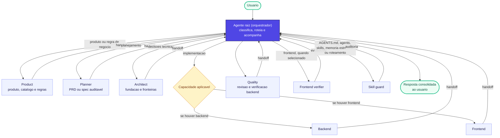
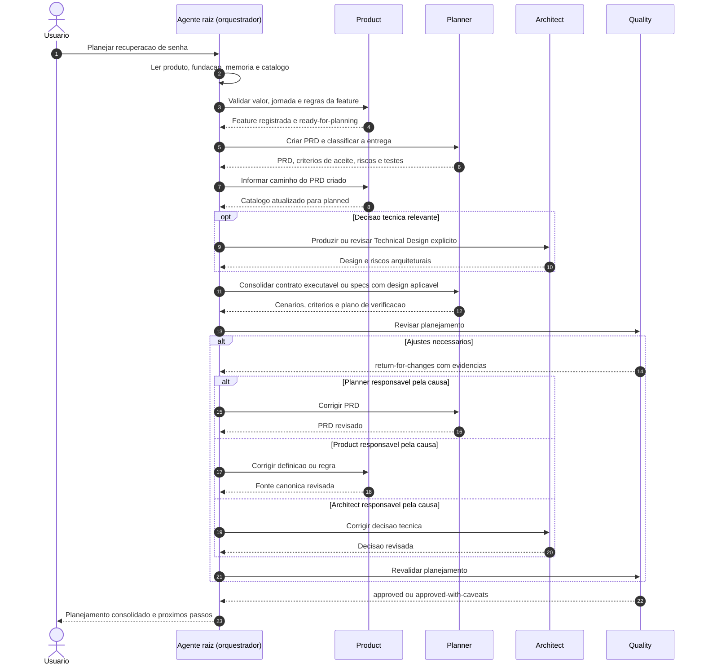
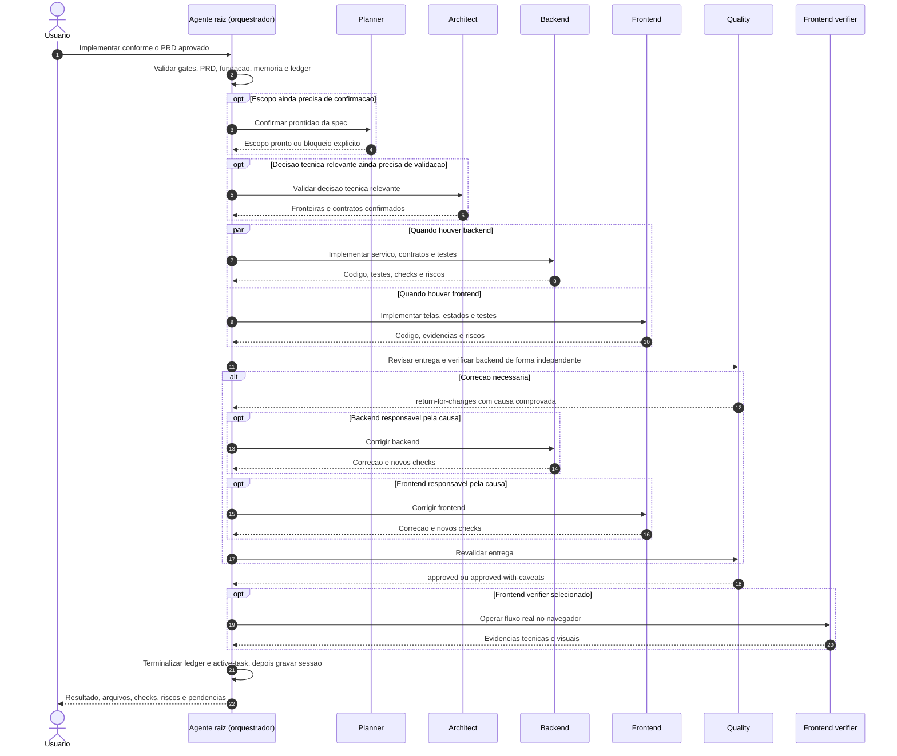

# Initial Development Harness

Um ponto de partida para conduzir desenvolvimento com agentes especializados, gates explicitos, planejamento auditavel, revisao independente, verificacao real e memoria operacional.

O harness fornece o sistema para definir produto, stack e arquitetura antes da implementacao e preservar as decisoes durante a evolucao do projeto. Este repositorio contem somente o harness generico. Os documentos-base de produto e fundacao tecnica comecam como `pending`; nao ha produto, stack, regras de negocio, PRDs ou specs de aplicacao predefinidos.

**O orquestrador e o proprio agente raiz: o agente principal com quem voce conversa.** Ele coordena os especialistas diretamente. Nao existe um subagente separado chamado `orchestrator` neste harness.

## Visao rapida

| Parte | Para que existe | Onde ver |
|---|---|---|
| Orquestracao pelo agente raiz | Selecionar agentes, aplicar gates e consolidar handoffs | [Orquestracao de agentes](#como-funciona-a-orquestracao-de-agentes) |
| Produto | Preservar problema, usuarios, valor, escopo, jornadas e regras | [`docs/product/`](docs/product/) |
| Fundacao tecnica | Definir stack, fronteiras, capacidades, comandos e testes | [`docs/project/technical-foundation.md`](docs/project/technical-foundation.md) |
| Planejamento | Transformar features em PRDs executaveis ou specs auditaveis | [`docs/planning/`](docs/planning/) |
| Agentes e skills | Separar responsabilidades e procedimentos especializados | [`.codex/agents/`](.codex/agents/) e [`.codex/skills/`](.codex/skills/) |
| Memoria operacional | Manter tarefa ativa, sessoes, decisoes e contexto reutilizavel | [Skill de memoria](.codex/skills/memory/manage-operational-memory/SKILL.md) |
| Qualidade e verificacao | Evitar autoaprovacao e produzir evidencias independentes | [`AGENTS.md`](AGENTS.md) |

## Execucoes principais

Estas sao as execucoes mais relevantes para entender e apresentar o harness. O agente raiz escolhe o fluxo e dispensa etapas apenas quando houver justificativa.

| Execucao | Quando acontece | Agentes mais comuns | Resultado |
|---|---|---|---|
| Definicao inicial | O repositorio ainda nao tem produto ou fundacao tecnica `ready` | `product` -> `planner` + `architect` | Produto e fundacao prontos para planejar |
| Planejamento de feature | Uma feature esta `ready-for-planning` | `product` -> `planner` -> `architect` quando necessario -> `quality` | PRD executavel ou specs aprovadas |
| Implementacao backend | A entrega altera servicos, contratos, dados ou integracoes | `backend` -> `quality` (revisao e verificacao backend) | Codigo, testes e verificacao tecnica independente |
| Implementacao frontend | A entrega altera interface, estados ou navegacao | `frontend` -> `quality` -> `frontend_verifier` quando selecionado | Interface testada e evidencias tecnicas/visuais aplicaveis |
| Implementacao full-stack | Backend e frontend mudam com contrato e escopo fechados | `backend` + `frontend` -> `quality` -> `frontend_verifier` quando selecionado | Fluxo integrado e verificado ponta a ponta |
| Mudanca de regra de negocio | Uma regra e criada, alterada ou removida | `product` antes de planejamento ou implementacao | Regra canonica revisada; mudanca material confirmada pelo usuario |
| Evolucao do harness | Mudam `AGENTS.md`, agents, skills, memoria estrutural ou roteamento | owner da mudanca -> `quality` -> `skill_guard` | Sistema de agentes coerente e auditado |

Sempre que a mudanca puder tornar skills obsoletas, o agente raiz chama `skill_guard` para analisar o impacto antes das correcoes. Os responsaveis ajustam os artefatos, `quality` revisa e `skill_guard` realiza a auditoria final. Esse ciclo tambem se aplica a mudancas em codigo, contratos, comandos e regras que afetem as skills.

### Por que separar essas execucoes

- **Definicao inicial** impede que stack e arquitetura sejam escolhidas antes de o problema estar claro.
- **Planejamento** separa decisoes de produto e tecnica da escrita de codigo.
- **Implementacao** seleciona somente as capacidades aplicaveis, exige escopo aprovado, testes proporcionais e revisao por outro agente.
- **Mudanca de regra** volta ao `product` para impedir que comportamento de negocio seja alterado silenciosamente.
- **Evolucao do harness** protege o proprio sistema de coordenacao contra regras conflitantes ou referencias quebradas.

## Do produto ao contrato executavel

```text
Product -> PRD -> Technical Design (quando necessario)
        -> PRD executable ou specs verticais
        -> Implementation -> Quality Review -> verificacao aplicavel
```

Product decide problema, usuarios, valor e regras. Planner define a entrega e como comprova-la. Architect produz ou revisa Technical Design quando ha decisoes arquiteturais relevantes; decisoes simples ficam no PRD/spec. O design pode ser uma secao ou documento vinculado. A fundacao tecnica continua global; decisoes duraveis do projeto podem gerar ADRs.

Um PRD `executable` cobre uma entrega pequena ou media, fechada e verificavel ponta a ponta. `requires-specs` divide multiplas entregas verticais, nunca apenas tabela, endpoint, componente ou testes. O PRD explica o que, por que, resultado, fluxo e limites; specs detalham o contrato sem antecipar codigo de producao.

Cenarios Given/When/Then tornam regras, estados, erros e contratos verificaveis. O plano define expectativas e cobertura; implementadores escrevem testes reais. Pseudocodigo curto, schemas e exemplos so entram para eliminar ambiguidade. Quality confere aderencia ao contrato e ao Technical Design, alem do resultado dos testes.

Para UI, o planejamento registra estados aplicaveis, acessibilidade e `Visual evidence expectations`. Define o que comprovar; o frontend verifier decide como operar o navegador, capturar screenshots e relacionar evidencias aos criterios. Mockups nao substituem verificacao real.

O root avalia complexidade e risco antes de chamar planner. Manutencao simples pode seguir escopo explicito -> implementacao -> quality proporcional, com justificativa registrada. Features continuam exigindo PRD e gates de produto/fundacao; a excecao nao elimina revisao de regras ou garantias de qualidade.

## Primeiro passo em um projeto novo

Antes de implementar codigo, abra [`docs/project/START_HERE.md`](docs/project/START_HERE.md) e solicite ao agente raiz a definicao inicial. Ele chama `product` primeiro e, quando o produto estiver suficiente, coordena `planner` e `architect` para fechar a fundacao tecnica.

```text
Conduza, como agente raiz, a definicao inicial deste projeto seguindo
docs/project/START_HERE.md. Defina primeiro o produto e depois a fundacao tecnica.
Nao planeje features nem implemente codigo enquanto os gates estiverem pending.
```

O usuario nao precisa escolher os demais agentes. O planejamento de features so comeca quando produto e fundacao tecnica estao `ready`; toda implementacao de feature parte de um PRD `executable` ou de uma spec aprovada. Manutencao simples, local e de baixo risco pode usar o fluxo curto com escopo, aceite e checks registrados.

<details>
<summary>O que a definicao inicial prepara</summary>

- produto, usuarios, valor, escopo, jornadas e regras em `docs/product/`;
- tipo de projeto, capacidades, stack, arquitetura, comandos e testes na fundacao tecnica;
- contrato do repositorio em `AGENTS.md` e agentes/skills aplicaveis;
- memoria operacional e validacao do sistema de agentes.

</details>

## Como funciona a orquestracao de agentes

O agente raiz executa diretamente a skill `primary-agent-coordination`; a coordenacao nao e delegada a um subagente. O projeto usa um modelo **hub-and-spoke** para todo trabalho que exija coordenacao: o agente raiz aplica os readiness gates, escolhe os agentes especializados, acompanha seus handoffs e consolida a resposta final. Os agentes podem trocar mensagens pela infraestrutura, mas o fluxo oficial nao depende de conversa direta entre eles: a coordenacao e centralizada no agente raiz.

Uma consulta pode ser respondida diretamente, sem iniciar o fluxo coordenado, somente quando TODOS os criterios forem atendidos: ela e pontual e limitada, deriva do estado local ja existente, e estritamente read-only sem alterar worktree, index, refs, memoria, cache ou estado externo, nao altera artefato e nao requer julgamento especializado, readiness gate, agente, revisao ou verificacao. Se qualquer criterio falhar, o agente raiz inicia o fluxo coordenado.

O diagrama abaixo representa o fluxo coordenado, iniciado quando a excecao de consulta direta nao se aplica:



### Ciclo de uma chamada

Para cada etapa, o agente raiz:

1. verifica as fontes canonicas e os gates aplicaveis;
2. registra o agente no **Agent Call Ledger**;
3. chama o agente real com objetivo, escopo e contexto relevante;
4. recebe seu handoff com artefatos, evidencias, riscos e bloqueios;
5. atualiza o ledger e a memoria operacional;
6. decide se chama o proximo agente, devolve uma falha ao responsavel ou encerra a tarefa.

O estado normal de uma chamada e:

```text
selected -> called -> handoff_received
                  \-> blocked
```

Uma tarefa nao deve ser encerrada com agentes ainda em `selected` ou `called`. Etapas dispensadas ficam como `skipped` e precisam de justificativa. Uma falha volta ao agente responsavel quando a causa estiver comprovada; se a causa for incerta, o fluxo permanece bloqueado ate o diagnostico.

### Exemplo pratico: planejamento de uma feature

Imagine a solicitacao: **"planeje uma feature de recuperacao de senha"**. O exemplo pressupoe que a definicao do produto e a fundacao tecnica estao `ready`. Se o produto ainda estiver `pending`, o fluxo para no gate de produto e o `product` conduz primeiro a definicao inicial. Se a fundacao estiver ausente, `pending` ou insuficiente, o agente raiz chama `planner` e `architect` para defini-la e nao inicia o planejamento da feature ate que ela esteja pronta.



Resultado esperado desse fluxo:

- a feature fica registrada no catalogo de produto;
- o PRD define escopo, fora de escopo, comportamento, representacao visual aplicavel, impacto de arquivos, aceite e testes;
- decisoes tecnicas relevantes ficam explicitas, sem serem inventadas pelo `planner`;
- `quality` revisa se o planejamento e implementavel, auditavel e testavel;
- nenhum codigo de produto e implementado durante o fluxo de planejamento.

Um ledger terminal simplificado poderia ficar assim:

| Agente | Status | Handoff ou justificativa |
|---|---|---|
| `product` | `handoff_received` | Feature liberada para planejamento |
| `planner` | `handoff_received` | PRD executavel entregue |
| `architect` | `skipped` | Nenhuma decisao tecnica nova |
| `quality` | `handoff_received` | `approved` em `planning-review` |
| `skill_guard` | `skipped` | Nenhum impacto em skills ou mudanca no sistema de agentes identificado |

Se o planejamento puder tornar skills obsoletas ou alterar o sistema de agentes, o `skill_guard` deixa de ser `skipped` e realiza a auditoria antes do fechamento. Mudanca material de produto permanece `blocked` ate confirmacao explicita do usuario, sempre intermediada pelo agente raiz.

### Exemplo pratico: implementacao de uma feature

Agora imagine: **"implemente a recuperacao de senha conforme o PRD aprovado"**. O exemplo pressupoe produto e fundacao tecnica `ready`, alem de PRD `executable` ou spec aprovada. Se a solicitacao mudar uma regra de negocio, o `product` precisa revisar essa mudanca antes da implementacao. O diagrama ilustra uma entrega full-stack; em uma feature somente backend ou somente frontend, apenas a capacidade aplicavel e chamada.



Nesse exemplo, backend e frontend so trabalham em paralelo porque o contrato e o escopo ja estao fechados. Se apenas uma capacidade for aplicavel, o outro agente fica `skipped` com justificativa. `quality` revisa a entrega e executa a verificacao independente de backend com a skill `verify-backend-flow`. Seu handoff inclui comandos, resultados e riscos; ele tambem coordena os checks compartilhados para evitar duplicacao. Quando selecionado, `frontend_verifier` continua responsavel pela operacao real no navegador. Uma falha de verificacao retorna pelo agente raiz ao agente responsavel; depois da correcao, revisao e verificacao sao repetidas na proporcao do impacto.

Um ledger terminal para uma mudanca full-stack pequena poderia ser:

| Agente | Status | Handoff ou justificativa |
|---|---|---|
| `planner` | `skipped` | Spec aprovada ja estava pronta |
| `architect` | `skipped` | Contratos existentes foram preservados |
| `backend` | `handoff_received` | Implementacao e testes entregues |
| `frontend` | `handoff_received` | Interface, estados e checks leves entregues |
| `quality` | `handoff_received` | `approved` em `implementation-review`, com evidencias de verificacao backend |
| `frontend_verifier` | `skipped` | Mudanca pequena; checks leves ficaram com `frontend` |
| `skill_guard` | `skipped` | Analise de impacto nao identificou skills afetadas nem mudancas no sistema de agentes |

Se o `frontend_verifier` tiver sido selecionado, indisponibilidade do navegador gera `blocked`, nunca `skipped`. Antes da resposta final, o agente raiz incorpora o ultimo handoff, terminaliza o ledger e deixa `active-task.md` como `idle` ou `blocked` com causa e proximo passo.

### Como o contexto passa entre agentes

Um agente nao deve depender de receber toda a transcricao dos agentes anteriores. A continuidade usa uma combinacao de mecanismos:

- o payload enviado pelo agente raiz ao iniciar a chamada;
- o handoff devolvido pelo agente anterior;
- os arquivos compartilhados no repositorio, incluindo produto, fundacao tecnica, PRDs, specs, decisoes, codigo e diff;
- a memoria operacional em `.codex/memory/`.

Nas execucoes multiagente deste projeto, os agentes compartilham o filesystem do repositorio, portanto alteracoes feitas por um agente ficam imediatamente disponiveis aos demais. Ainda assim, documentos canonicos e handoffs explicitos sao preferidos a contexto implicito de conversa.

### Papel da memoria operacional

A memoria preserva continuidade e checkpoints do trabalho, mas nao substitui Git, PRD, spec ou documentacao canonica.

| Caminho | Responsabilidade |
|---|---|
| `.codex/memory/active-task.md` | Objetivo corrente, fluxo, ledger, estado, checks e bloqueios |
| `.codex/memory/sessions/` | Resumos finais de execucoes substanciais |
| `.codex/memory/decisions/` | Rascunhos locais e checkpoints nao canonicos; decisoes duraveis de produto e tecnica ficam em `docs/decisions/` |
| `.codex/memory/projects/` | Contexto estavel e verificado do projeto |
| `.codex/memory/runbooks/` | Procedimentos reproduziveis e validados |
| `.codex/memory/errors/` | Falhas recorrentes com causa comprovada |

O agente raiz e o owner da memoria. Agentes especializados entregam fatos, decisoes, evidencias e riscos em seus handoffs; o agente raiz registra apenas o que precisa sobreviver a chamada. Como essa memoria e um checkpoint operacional mantido pelo fluxo, ela precisa ser atualizada e terminalizada explicitamente no fechamento.

### Paralelismo e independencia

Backend e frontend podem trabalhar em paralelo quando escopo e contratos estiverem fechados. Quem implementa nao aprova sozinho a propria entrega: mudancas de codigo passam por `quality`, backend exige verificacao independente pelo proprio `quality`, frontend usa os criterios de selecao de `frontend_verifier`, e mudancas no sistema de agentes exigem `skill_guard`.

As regras detalhadas de roteamento ficam em `.codex/skills/coordination/primary-agent-coordination/`; as responsabilidades individuais ficam em `.codex/agents/`; e as invariantes permanentes do repositorio ficam em `AGENTS.md`.

Ao adotar este harness em outro repositorio, adapte o README para apresentar o produto e suas instrucoes de desenvolvimento. Neste repositorio, o README apresenta o harness; as regras oficiais de coordenacao permanecem em `AGENTS.md` e na skill `primary-agent-coordination`.

## Rastreabilidade de contratos substituidos

PRDs e specs comecam com `Status`, `Supersedes`, `Superseded by` e `Related decisions`. Os links relativos conectam contratos anteriores, sucessores e decisoes canonicas em `docs/decisions/`. A justificativa completa permanece na decisao; Git preserva diffs, mas nao substitui essa navegacao.

Product/Architect avalia a mudanca e registra a decisao; Planner cria o contrato sucessor e atualiza os links nos dois sentidos. O documento anterior recebe `superseded`, preserva seu conteudo historico e deixa de ser executavel. `ready` indica planejamento pronto; `active` identifica o contrato aceito como vigente e nao significa implementacao concluida. `draft` e `blocked` continuam impedindo execucao prematura.

Veja as [regras de rastreabilidade](.codex/skills/planning/create-spec-driven-plan/references/contract-traceability.md).
