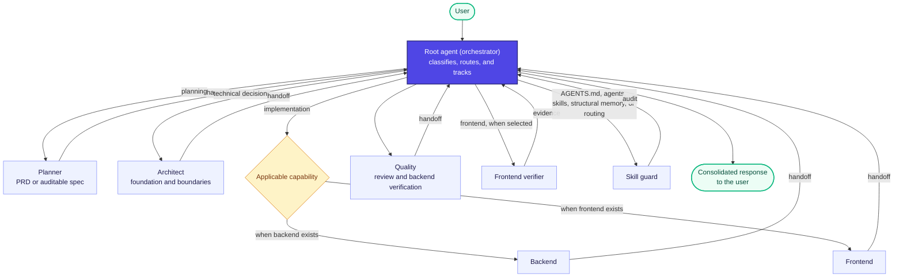
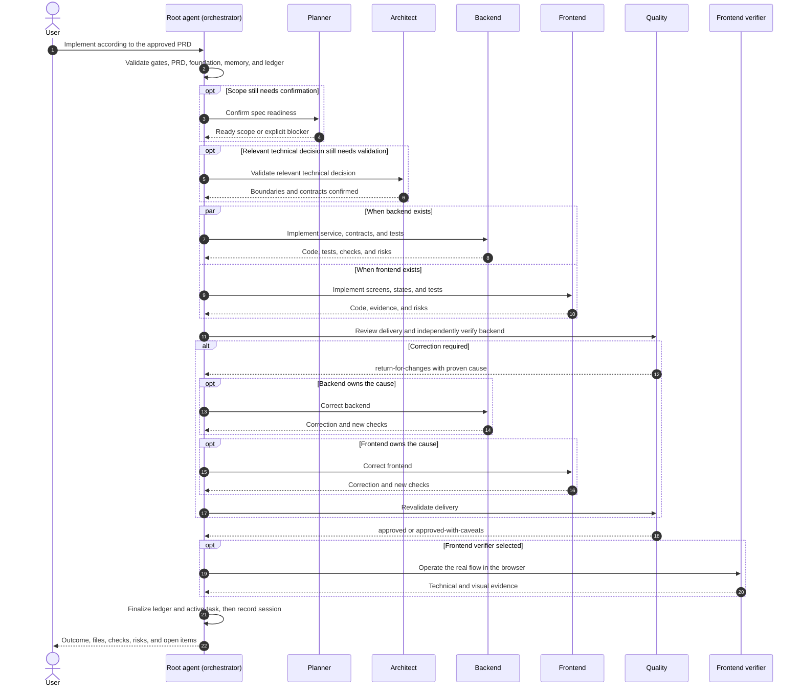

# Initial Development Harness

A starting point for development with specialized agents, explicit gates, auditable planning, independent review, real verification, and operational memory.

The harness provides a system for defining the product, stack, and architecture before implementation and preserving decisions as the project evolves. This repository contains only the generic harness. The product and technical-foundation templates start as `pending`; no application product, stack, business rules, PRDs, or specs are predefined.

**The orchestrator is the root agent: the main agent you talk to.** It coordinates specialists directly and governs the product definition, feature catalog, and business rules using `define-and-govern-product`, under user decision authority. There is no separate `orchestrator` subagent in this harness.

## At a glance

| Part | Purpose | Reference |
|---|---|---|
| Root-agent orchestration | Select agents, enforce gates, and consolidate handoffs | [Agent orchestration](#how-agent-orchestration-works) |
| Product | Preserve the problem, users, value, scope, journeys, and rules | [`docs/product/`](docs/product/) |
| Technical foundation | Define the stack, boundaries, capabilities, commands, and tests | [`docs/project/technical-foundation.md`](docs/project/technical-foundation.md) |
| Planning | Turn features into executable PRDs or auditable specs | [`docs/planning/`](docs/planning/) |
| Agents and skills | Separate specialized responsibilities from procedures | [`.codex/agents/`](.codex/agents/) and [`.codex/skills/`](.codex/skills/) |
| Operational memory | Maintain the active task, sessions, decisions, and reusable context | [Memory skill](.codex/skills/memory/manage-operational-memory/SKILL.md) |
| Quality and verification | Prevent self-approval and produce independent evidence | [`AGENTS.md`](AGENTS.md) |

## Prerequisites and adoption

This is a collection of instructions, agent definitions, skills, and documentation templates. It does not bundle an agent runtime, installation scripts, or a host configuration that registers the agents for you.

To use the coordinated workflow, you need an agent-capable host that can read and edit repository files, execute the project's eventual verification commands, and invoke actual specialized agents. The definitions in `.codex/agents/` and procedures in `.codex/skills/` must be made available through that host's supported configuration. Do not assume that copying these files automatically registers agents or skills in every host. Frontend verification also requires an operational browser backend when that stage is selected.

1. Obtain a local checkout and inspect [`AGENTS.md`](AGENTS.md), the agent definitions, and the skills.
2. Configure your host to expose the required agents and skills and give them access to the project workspace. The documented multi-agent workflow assumes a shared repository filesystem.
3. For an adopting project, bring the harness instructions, `.codex/agents/`, `.codex/skills/`, and `docs/` templates into that repository, reconciling existing project instructions and documents instead of overwriting them. Merge the relevant entries from this repository's `.gitignore`, including `.codex/memory`, into the adopting repository's `.gitignore` without overwriting its existing entries.
4. Ask the root agent to follow [`docs/project/START_HERE.md`](docs/project/START_HERE.md), using the example prompt below. Define the product before selecting the stack or architecture.

There are no application build, test, or start commands yet. The adopting project's technical foundation records those commands once its stack is defined. See [License](#license) for reuse and redistribution terms.

## Repository layout

```text
.
|-- AGENTS.md                  # Permanent repository invariants
|-- README.md                  # Harness overview and onboarding
|-- .codex/
|   |-- agents/                # Specialized agent definitions (.toml)
|   |-- skills/                # Procedures, references, and templates
|   `-- memory/                # Local operational context, initialized during work
`-- docs/
    |-- product/               # Canonical product definition and catalog
    |-- project/               # Initial-definition guide and technical foundation
    |-- planning/              # PRDs and derived specs
    `-- decisions/             # Canonical product and project decisions
```

Operational memory is local and Git-ignored; it is not a substitute for the shared documents under `docs/`.

## Quality Gates

Quality gates are explicit conditions for advancing or completing work. The root agent checks the applicable criteria; a blocked stage cannot be treated as complete.

| Stage | Criteria for proceeding |
|---|---|
| Definition and planning | The product and technical foundation must be `ready` before feature planning. The feature must be `ready-for-planning` before its PRD is created. |
| Feature implementation | Requires an `executable` PRD or approved spec, with scope, acceptance criteria, and dependencies resolved. `superseded` contracts do not authorize implementation. |
| Tests | Business-rule changes require unit tests; changes to flows, contracts, persistence, or integrations require integration tests proportional to risk. |
| Independent review | Implementers do not approve their work alone. Code changes receive `quality` review, including independent backend verification when applicable. |
| Frontend verification | When selected by the routing criteria, `frontend_verifier` operates the real flow and presents evidence. An unavailable browser blocks the stage; it does not justify skipping it. |
| Harness consistency | Changes to instructions, agents, skills, structural memory, or routing require `skill_guard` review. Other changes that may make skills obsolete also require impact analysis and an audit. |
| Completion | Reported checks require real evidence; the ledger cannot contain pending calls. Failures return to the responsible owner, and blockers must identify a cause and next step. |

Simple maintenance may use the short flow with recorded scope, acceptance criteria, and proportional checks. This does not remove applicable invariants or allow stages to be skipped without justification.

This table summarizes the rules; the authoritative sources remain [`AGENTS.md`](AGENTS.md) and the [routing criteria](.codex/skills/coordination/primary-agent-coordination/references/routing.md).

## Main workflows

These are the main workflows for understanding and presenting the harness. The root agent selects the flow and skips stages only with a recorded reason.

| Workflow | When it applies | Agents or prerequisite review | Outcome |
|---|---|---|---|
| Initial definition | The repository does not yet have a `ready` product or technical foundation | Root-agent product definition, then `planner` + `architect` | Product and foundation ready for planning |
| Feature planning | A feature is `ready-for-planning` | `planner` -> `architect` when needed -> `quality` | Executable PRD or approved specs |
| Backend implementation | The deliverable changes services, contracts, data, or integrations | `backend` -> `quality` (review and backend verification) | Code, tests, and independent technical verification |
| Frontend implementation | The deliverable changes the interface, states, or navigation | `frontend` -> `quality` -> `frontend_verifier` when selected | Tested interface and applicable technical/visual evidence |
| Full-stack implementation | Backend and frontend change with settled contracts and scope | `backend` + `frontend` -> `quality` -> `frontend_verifier` when selected | Integrated flow verified end to end |
| Business-rule change | A rule is created, changed, or removed | Root-agent business-rule review before planning or implementation | Reviewed canonical rule; material change confirmed by the user |
| Harness evolution | Changes affect `AGENTS.md`, agents, skills, structural memory, or routing | Change owner -> `quality` -> `skill_guard` | Consistent, audited agent system |

Whenever a change may make skills obsolete, the root agent calls `skill_guard` to analyze the impact before corrections. Owners update the artifacts, `quality` reviews them, and `skill_guard` performs the final audit. This cycle also applies to changes in code, contracts, commands, and rules that affect skills.

### Why separate these workflows

- **Initial definition** prevents choosing the stack and architecture before the problem is clear.
- **Planning** separates product and technical decisions from writing code.
- **Implementation** selects only applicable capabilities and requires approved scope, proportional tests, and review by another agent.
- **Rule changes** require review of the canonical business rules to prevent silent changes to business behavior.
- **Harness evolution** protects the coordination system from conflicting rules or broken references.

## From product to executable contract

```text
Product definition -> PRD -> Technical Design (when needed)
        -> executable PRD or vertical specs
        -> Implementation -> Quality Review -> applicable verification
```

The root agent maintains the product definition, which records the problem, users, value, and rules, using the [product governance skill](.codex/skills/product/define-and-govern-product/SKILL.md). Product decisions remain subject to user authority. Planner defines the deliverable and how to prove it works. Architect produces or reviews Technical Design for relevant architectural decisions; simple decisions stay in the PRD/spec. The design may be a section or a linked document. The technical foundation remains global; durable project decisions may produce architecture decision records (ADRs).

An `executable` PRD covers one small or medium deliverable with settled scope that can be verified end to end. `requires-specs` splits multiple vertical deliverables, never just a table, endpoint, component, or tests. The PRD explains what, why, outcome, flow, and boundaries; specs detail the contract without prescribing production code.

Given/When/Then scenarios make rules, states, errors, and contracts verifiable. The plan defines expectations and coverage; implementers write the actual tests. Short pseudocode, schemas, and examples are included only to remove ambiguity. Quality checks compliance with the contract and Technical Design, as well as test results.

For UI work, planning records applicable states, accessibility, and `Visual evidence expectations`. It defines what must be proven; the frontend verifier decides how to operate the browser, capture screenshots, and map evidence to criteria. Mockups do not replace real verification.

The root agent assesses complexity and risk before calling planner. Simple maintenance may follow explicit scope -> implementation -> proportional quality review, with a recorded justification. Features still require a PRD and product/foundation gates; the exception does not remove rule review or quality guarantees.

## First step in a new project

Before implementing code, open [`docs/project/START_HERE.md`](docs/project/START_HERE.md) and ask the root agent to conduct the initial definition. The root agent directly applies `define-and-govern-product` first. Once the product definition is `ready` and sufficient, the root agent coordinates `planner` and `architect` to complete the technical foundation. Missing product decisions block dependent work until they are recorded in the canonical definition.

```text
As the root agent, conduct this project's initial definition following
docs/project/START_HERE.md. Define the product first, then the technical foundation.
Do not plan features or implement code while the readiness gates remain pending.
```

The user does not need to choose the other agents. Feature planning begins only when the product and technical foundation are `ready`; every feature implementation starts from an `executable` PRD or approved spec. Simple, local, low-risk maintenance may use the short flow with recorded scope, acceptance criteria, and checks.

<details>
<summary>What initial definition prepares</summary>

- Product, users, value, scope, journeys, and rules under `docs/product/`.
- Project type, capabilities, stack, architecture, commands, and tests in the technical foundation.
- The repository contract in `AGENTS.md` and applicable agents/skills.
- Operational memory and validation of the agent system.

</details>

## How agent orchestration works

The root agent executes the `primary-agent-coordination` skill directly; coordination is not delegated to a subagent. The project uses a **hub-and-spoke** model for all work requiring coordination: the root agent applies readiness gates, selects specialized agents, tracks their handoffs, and consolidates the final response. Agents can exchange messages through the infrastructure, but the official flow does not depend on direct conversations between them: coordination is centralized in the root agent.

A request can be answered directly, without starting the coordinated flow, only when ALL criteria are met: it is narrow and limited, derives from existing local state, is strictly read-only without changing the worktree, index, refs, memory, cache, or external state, changes no artifact, and requires no specialist judgment, readiness gate, agent, review, or verification. If any criterion fails, the root agent starts the coordinated flow.

The diagram below represents the coordinated flow, which begins when the direct-request exception does not apply:



### Lifecycle of an agent call

For each stage, the root agent:

1. Checks canonical sources and applicable gates.
2. Records the agent in the **Agent Call Ledger**.
3. Invokes the actual agent with the objective, scope, and relevant context.
4. Receives its handoff with artifacts, evidence, risks, and blockers.
5. Updates the ledger and operational memory.
6. Decides whether to call the next agent, return a failure to its owner, or close the task.

The normal call lifecycle is:

```text
selected -> called -> handoff_received
                  \-> blocked
```

A task must not close with agents still in `selected` or `called`. Omitted stages are recorded as `skipped` with a reason. A failure returns to the responsible agent when its cause is proven; if the cause is uncertain, the flow remains blocked until diagnosed.

### Example: planning a feature

Imagine the request: **"plan a password-recovery feature."** This example assumes the product definition and technical foundation are `ready`. The feature must also be recorded as `ready-for-planning` in the product catalog. If the product is still `pending` or required product decisions are missing, the flow stops at the product gate until the canonical definition is ready and sufficient. If the foundation is missing, `pending`, or insufficient, the root agent calls `planner` and `architect` to define it and does not begin feature planning until it is ready.

```mermaid
sequenceDiagram
    autonumber
    actor U as User
    participant O as Root agent (orchestrator)
    participant PL as Planner
    participant A as Architect
    participant Q as Quality

    U->>O: Plan password recovery
    O->>O: Read product, foundation, memory, and catalog
    O->>O: Review product decisions and release the feature for planning
    Note over O,PL: Prerequisite: feature value, journey, and rules recorded; catalog status ready-for-planning
    O->>PL: Create PRD and classify the deliverable
    PL-->>O: PRD, acceptance criteria, risks, and tests
    O->>O: Record the PRD path and planned status in the catalog
    opt Relevant technical decision
        O->>A: Produce or review explicit Technical Design
        A-->>O: Design and architectural risks
    end
    O->>PL: Consolidate executable contract or specs with applicable design
    PL-->>O: Scenarios, criteria, and verification plan
    O->>Q: Review planning
    alt Changes required
        Q-->>O: return-for-changes with evidence
        alt Planner owns the cause
            O->>PL: Correct PRD
            PL-->>O: Revised PRD
        else Canonical product definition or rule needs correction
            O->>O: Review and correct the canonical product source
            Note over O,Q: Material or conflicting changes stay blocked until user confirmation
        else Architect owns the cause
            O->>A: Correct technical decision
            A-->>O: Revised decision
        end
        O->>Q: Revalidate planning
    end
    Q-->>O: approved or approved-with-caveats
    O-->>U: Consolidated plan and next steps
```

Expected outcomes:

- The feature is recorded in the product catalog.
- The PRD defines scope, exclusions, behavior, applicable visual representation, file impact, acceptance criteria, and tests.
- Relevant technical decisions are explicit, rather than invented by `planner`.
- `quality` reviews whether the plan is implementable, auditable, and testable.
- No product code is implemented during the planning flow.

A simplified final ledger could look like this:

| Agent | Status | Handoff or reason |
|---|---|---|
| `planner` | `handoff_received` | Executable PRD delivered |
| `architect` | `skipped` | No new technical decision |
| `quality` | `handoff_received` | `approved` in `planning-review` |
| `skill_guard` | `skipped` | No skill impact or agent-system change identified |

If planning may make skills obsolete or change the agent system, `skill_guard` is no longer `skipped` and audits the changes before closure. A material product change remains `blocked` until explicit user confirmation, always mediated by the root agent.

### Example: implementing a feature

Now imagine: **"implement password recovery according to the approved PRD."** This example assumes a `ready` product and technical foundation, plus an `executable` PRD or approved spec. If the request changes a business rule, the root agent reviews that change using `define-and-govern-product` and updates the canonical rules before implementation. Material or conflicting product changes require explicit user confirmation. The diagram illustrates a full-stack deliverable; for a backend-only or frontend-only feature, only the applicable capability is called.



In this example, backend and frontend work in parallel only because the contract and scope are settled. If only one capability applies, the other agent is `skipped` with a reason. `quality` reviews the deliverable and performs independent backend verification with the `verify-backend-flow` skill. Its handoff includes commands, results, and risks; it also coordinates shared checks to avoid duplication. When selected, `frontend_verifier` remains responsible for real browser operation. Verification failures return through the root agent to the responsible agent; after correction, review and verification are repeated in proportion to the impact.

A final ledger for a small full-stack change could be:

| Agent | Status | Handoff or reason |
|---|---|---|
| `planner` | `skipped` | Approved spec was already ready |
| `architect` | `skipped` | Existing contracts were preserved |
| `backend` | `handoff_received` | Implementation and tests delivered |
| `frontend` | `handoff_received` | Interface, states, and lightweight checks delivered |
| `quality` | `handoff_received` | `approved` in `implementation-review`, with backend verification evidence |
| `frontend_verifier` | `skipped` | Small change; lightweight checks remained with `frontend` |
| `skill_guard` | `skipped` | Impact analysis found no affected skills or agent-system changes |

If `frontend_verifier` was selected, an unavailable browser results in `blocked`, never `skipped`. Before the final response, the root agent incorporates the latest handoff, finalizes the ledger, and leaves `active-task.md` as `idle` or `blocked` with a cause and next step.

### How context passes between agents

An agent should not depend on receiving the full transcript of earlier agents. Continuity uses a combination of:

- The payload sent by the root agent when starting the call.
- The handoff returned by the previous agent.
- Shared repository files, including product, technical foundation, PRDs, specs, decisions, code, and diff.
- Operational memory in `.codex/memory/`.

In this project's multi-agent workflow, agents share the repository filesystem, so one agent's changes are immediately available to the others. Even so, canonical documents and explicit handoffs are preferred over implicit conversational context.

### Role of operational memory

Memory preserves continuity and work checkpoints, but does not replace Git, PRDs, specs, or canonical documentation.

| Path | Responsibility |
|---|---|
| `.codex/memory/active-task.md` | Current objective, flow, ledger, state, checks, and blockers |
| `.codex/memory/sessions/` | Final summaries of substantial work sessions |
| `.codex/memory/decisions/` | Local drafts and noncanonical checkpoints; durable product and technical decisions belong in `docs/decisions/` |
| `.codex/memory/projects/` | Stable, verified project context |
| `.codex/memory/runbooks/` | Reproducible, validated procedures |
| `.codex/memory/errors/` | Recurring failures with proven causes |

The root agent owns memory. Specialized agents return facts, decisions, evidence, and risks in their handoffs; the root agent records only what needs to survive the call. Because memory is an operational checkpoint maintained by the workflow, it must be explicitly updated and finalized at closure.

### Parallelism and independence

Backend and frontend may work in parallel when scope and contracts are settled. Implementers do not approve their own delivery alone: code changes receive `quality` review, backend requires independent verification by `quality`, frontend follows the selection criteria for `frontend_verifier`, and agent-system changes require `skill_guard`.

Detailed routing rules live in `.codex/skills/coordination/primary-agent-coordination/`; individual responsibilities live in `.codex/agents/`; and permanent repository invariants live in `AGENTS.md`.

When adopting this harness in another repository, adapt the README to introduce the product and its development instructions. In this repository, the README introduces the harness; the authoritative coordination rules remain in `AGENTS.md` and the `primary-agent-coordination` skill.

## Traceability of replaced contracts

PRDs and specs begin with `Status`, `Supersedes`, `Superseded by`, and `Related decisions`. Relative links connect predecessor contracts, successors, and canonical decisions in `docs/decisions/`. The full rationale remains in the decision; Git preserves diffs but does not replace this navigation.

The root agent evaluates product changes and records accepted product decisions; Architect evaluates and records relevant technical decisions. The canonical decision must be recorded before contract replacement. Planner creates the successor contract and updates links in both directions. The predecessor receives `superseded`, preserves its historical content, and is no longer executable. `ready` indicates completed planning; `active` identifies the contract accepted as current and does not mean implementation is complete. `draft` and `blocked` still prevent premature execution.

See the [traceability rules](.codex/skills/planning/create-spec-driven-plan/references/contract-traceability.md).

## Contributing and reporting issues

If Issues are enabled, use this repository's GitHub Issues for bug reports or documentation issues and include the relevant file or workflow, expected behavior, actual behavior, and reproduction steps when applicable. For host-specific problems, include the host and configuration details needed to reproduce the issue, without secrets or sensitive data.

For a proposed change, explain the problem, keep the diff focused, and describe the checks performed and any limitations in the pull request. Read [`AGENTS.md`](AGENTS.md) before working with agents in this repository. Changes to coordination rules, agents, or skills should keep their references and responsibilities consistent; the existing review requirements are described above.

## License

Licensed under the [MIT License](LICENSE). You may use, modify, and redistribute the harness under its terms; retain the copyright and permission notice.
